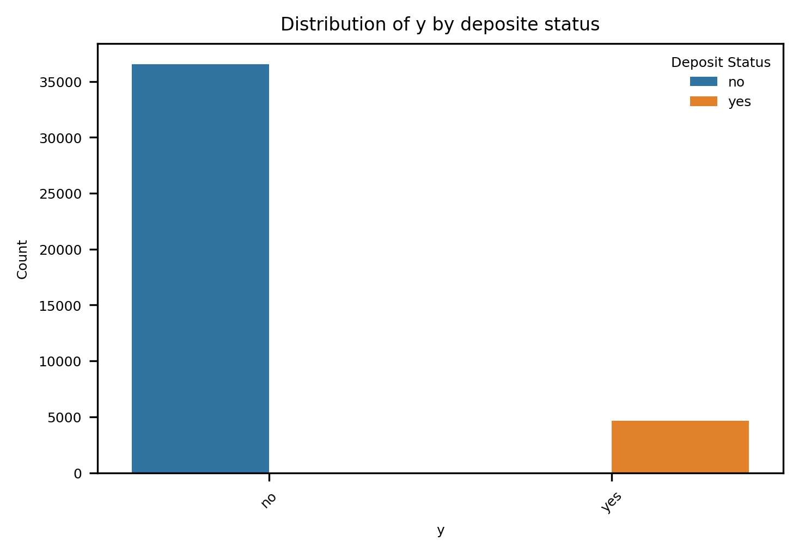

### Comparing Classifiers
This project compares the performance of four classifiers: Logistic Regression, K-Nearest Neighbors, Decision Tree,
and Support Vector Machine (SVM). We use a dataset related to the marketing of bank products conducted via 
telephone, obtained from the UCI Machine Learning Repository.

The data comes from a Portuguese banking institution and contains the results of multiple marketing campaigns.
It includes customer information, campaign details, and whether the client subscribed to a term deposit.
For a detailed description of the dataset and its features, we reference the accompanying research article
provided in the repository.

The goal of this machine learning project is to find the key factors that improve customer success rates.  For example:
-Do loan products have a positive impact on the customer success rate? For example, should we focus on customers with housing loans?
-Are we going to have a better success rate with customers with a university degree?
-How does the contact method (i.e., cellular) affect the success rate for long-term loan products?

##Understanding the Data
The dataset was checked for missing or problematic values, and none were found. Key features such as job, marital status, education, housing, and personal loans were reviewed to assess their potential impact on customer response and the success of the marketing campaign.
The charts below visualize key observations from the dataset. One of the most noticeable findings is the low overall success rate of the marketing campaign in persuading customers to sign up for the long-term deposit product, regardless of features such as education, marital status, job, or contact method.

 #Detailed Insights
When focusing only on customers who subscribed to the product (i.e., successful campaigns), the following patterns emerge:
-Marital Status – Higher success rates among married customers, followed by single individuals.
-Job – The campaign performed best with customers in administrative roles (a broad category), followed by technicians, and then blue-collar workers.
-Contact Method – Marketing efforts were more successful when using cellular contact compared to telephone.

