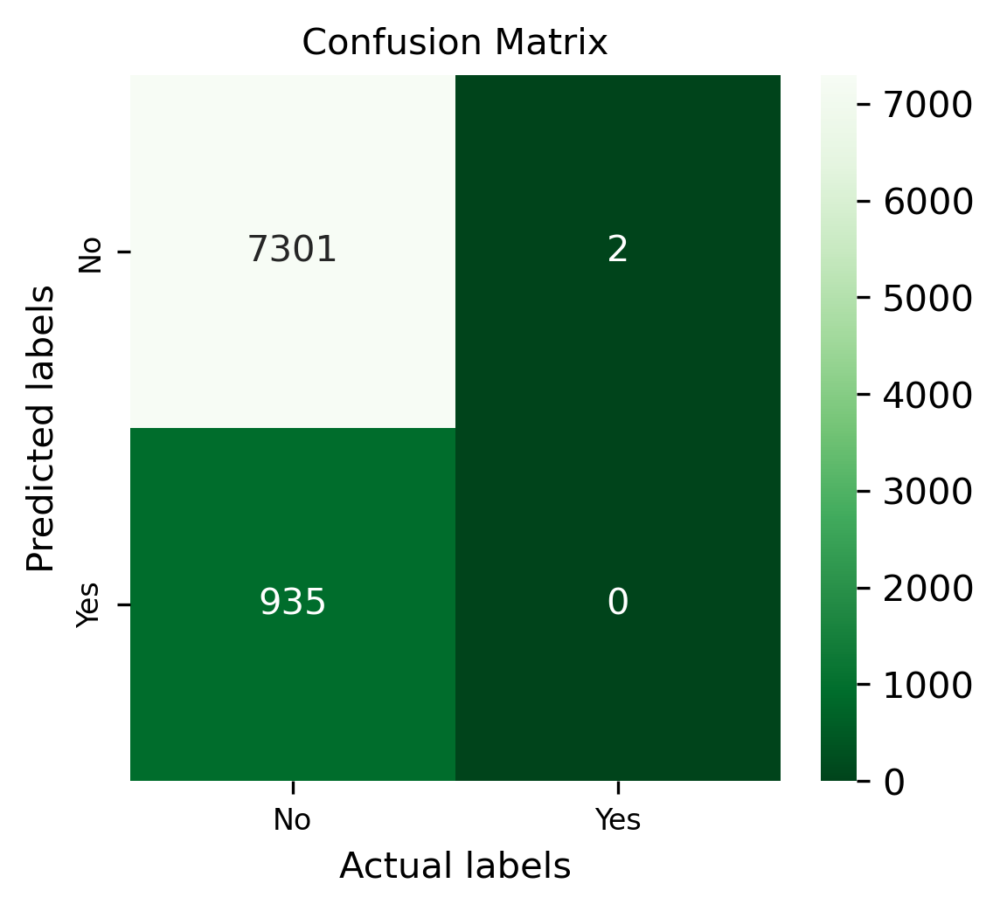

# Comparing Classifiers
This project compares the performance of four classifiers: 
- Logistic Regression
- K-Nearest Neighbors
- Decision Tree
- Support Vector Machine (SVM)
  
The dataset, obtained from the UCI Machine Learning Repository, related to the marketing of bank products conducted via telephone. It comes from a Portuguese banking institution and contains the results of multiple marketing campaigns, including customer information, campaign details, and whether the client subscribed to a term deposit.
For a detailed description of the dataset and its features, we refer to the accompanying research article
provided in the repository.

## Understanding the Data
This dataset contains 41,188 observations with 21 features.

The dataset was checked for missing or problematic values, and none were found. Key features such as job, marital status, education, housing, and personal loans were reviewed to assess their potential impact on customer response and the success of the marketing campaign.
The charts below visualize key observations from the dataset. One of the most notable findings is the low overall success rate of the marketing campaign in persuading customers to sign up for the long-term deposit product, regardless of features such as education, marital status, job, or contact method.

### Detailed Insights
When focusing only on customers who subscribed to the product (i.e., successful campaigns), the following patterns emerge:
   - Marital Status: higher success rates among married customers, followed by single individuals.
   - Job: campaign performed best with customers in administrative roles (a broad category), followed by technicians, and then blue-collar workers.
  - Contact Method: marketing efforts were more successful when using cellular contact compared to telephone.

## Understanding the Task
The goal of this machine learning project is to find the key factors that improve customer success rates.  For example:
 - Do loan products have a positive impact on the customer success rate? For example, should we focus on customers with housing loans?
 - Are we going to have a better success rate with customers with a university degree?
 - How does the contact method (i.e., cellular) affect the success rate for long-term loan products?
## Engineering Features
Apart from addressing the imbalanced nature of the dataset, the following steps were taken to prepare the data for modeling:
 - Selected features: job, marital, education, default, housing, loan, and contact to create the feature set.
 - Applied ColumnTransformer to perform tailored preprocessing:
   - Applied specific transformations to numerical columns.
   - Applied separate transformations to categorical columns.
- Encoded the target labels using LabelEncoder.
- Split the dataset into training and test sets using train_test_split, with 20% of the data allocated to testing

## Baseline Model
For the baseline model, we chose a DecisionTreeClassifier, a method capable of performing multi-class classification. This classifier works by applying different feature subsets and decision rules at various stages of classification.
In training, fitting and predicting the model on the dataset, the following results were observed:
| Model Name    | Accuracy       | Precision      | Recall 	      | F1_Score       | 
|-------------	 |:---------------|:---------------|:--------------|:---------------|
| Decision Tree | 0.8863         | 0.4432         | 0.4999        |  0.4699        | 

These result shows that the accuracy score was very close with number over 85%, however the recall, precision and F1_Score were below 50%.

This suggests that the classifier produced a high number of false negatives, meaning many actual positive cases (Deposit = "Yes") were misclassified as negative. Such an outcome is often due to an imbalanced dataset, where the number of "No" records greatly exceeds the number of "Yes" records, though it can also result from untuned model hyperparameters. In this case, the imbalance is the more likely cause.

For a detailed breakdown of the model’s performance, the confusion matrix is shown below, illustrating the distribution of true positives, true negatives, false positives, and false negatives.

## Simple Model/Score the Model
We use Logistic Regression to build a basic model on our data. Several metrics can be used to evaluate how well a Logistic Regression model fits the dataset, including sensitivity  and specificity. A useful way to visualize these metrics is with a ROC Curve, which plots sensitivity against 1 − specificity. In the ROC plot, a curve closer to the top-left corner indicates better performance.

For this model, the curve for Deposit = Yes is closer to the top-left corner than Deposit = No, suggesting stronger performance in identifying positive cases. The ROC AUC score is 0.6890, which is above 0.5, meaning the classifier correctly identifies more true positives and true negatives than false negatives and false positives.

## Model Comparisons
We now compare the performance of the Logistic Regression model with the KNN algorithm, Decision Tree, and SVM models. Using the default settings for each, we fit and score the models, then compare their training times.
| Model Name           | Train Time(s)       | Train Accuracy      | Test Accuracy	     | 
|--------------------- |:--------------------|:--------------------|:--------------------|
| Logistic Regression  | 0.1166              | 0.8875              | 0.8865              |   
| Decision Tree        | 0.1542              | 0.8915      	       | 0.8818              |
| KNN                  | 7.8325              | 0.8817              | 0.8773              |
| SVM                  |  13.6826            | 0.8877              |   0.8864            |                         

The comparison results show that Logistic Regression outperformed the other models, recording the highest training and testing accuracy, while also achieving the lowest training time in seconds.

## Improving the Model
To improve model performance beyond the baseline results, several strategies were explored:
- Feature engineering and exploration: examined the impact of individual features and considered whether to keep or remove certain variables
- Hyperparameter tuning: Used Grid Search to test different parameter combinations and evaluate performance metrics, such as adjusting the number of neighbors in KNN or the maximum depth in a Decision Tree.
- Performance metric adjustment: Selected evaluation metrics that align with the project’s goals. For imbalanced datasets, accuracy can be misleading, so metrics like recall, precision, F1-score, or ROC AUC may provide a better measure of performance.
 | Model Name           | Train Time(s)      | Best CV Score       | 	      
|--------------------- |:--------------------|:--------------------|
| Logistic Regression  | 9.4242              | 0.8876              | 
| Decision Tree        | 9.5872              | 0.8876      	       | 
| KNN                  | 239.7218            | 0.8863              | 
| SVM                  |  13.6826            | 0.8877              |  

## Next Steps and Recommendations
The main concern is the dataset’s imbalance, which is heavily weighted toward unsuccessful marketing campaigns. If the goal is to identify the features that contribute to campaign failures, the current models could still be useful. The imbalance is fine if the aim is to understand why campaigns fail, but if the goal is to predict successes, the imbalance would be a bigger problem.
